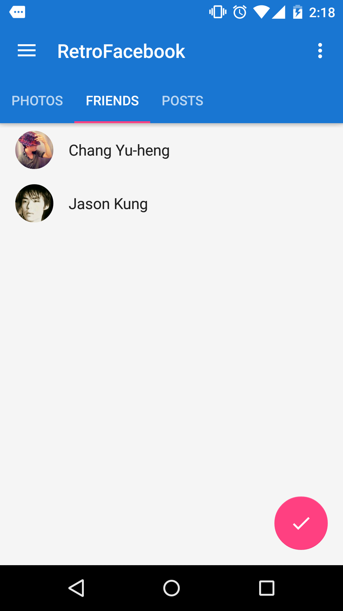
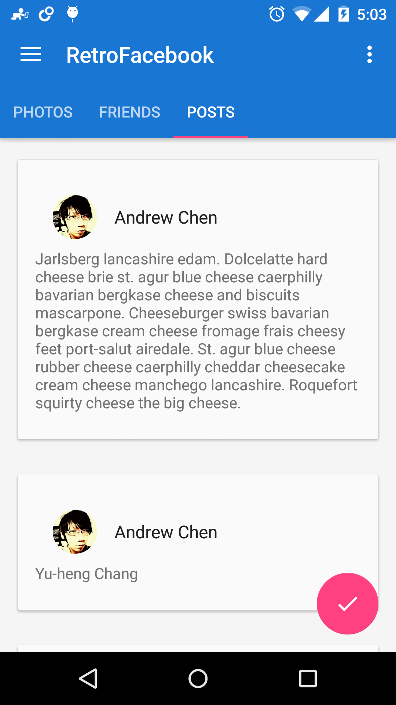

# RetroFacebook

[](https://android-arsenal.com/details/1/2007)
[](https://gitter.im/yongjhih/RetroFacebook?utm_source=badge&utm_medium=badge&utm_campaign=pr-badge&utm_content=badge)


Retrofit Facebook SDK.

RetroFacebook turns Facebook API into a Java interface.

Easy to add API and model.

Inspired by retrofit.





## Usage

My posts:

Before:

```java
GraphRequest request = GraphRequest.newGraphPathRequest(AccessToken.getCurrentAccessToken(), "/me/feed", new GraphRequest.Callback() {
    @Override
    public void onCompleted(GraphResponse response) {
        // Gson
        // Gson gson = new Gson();
        // Posts posts = gson.fromJson(response.getJSONObject().toString(), Posts.class);
        // or
        // jackson
        // ObjectMapper mapper = new ObjectMapper();
        // Posts posts = mapper.readValue("{\"name\":\"Bob\", \"age\":13}", Posts.class);
        // or
        // LoganSquare
        // Posts posts = LoganSquare.parse(response.getJSONObject().toString(), Posts.class);
        // or manual
        
        // hasNext?  request = response.getRequestForPagedResults(GraphResponse.PagingDirection.NEXT); blah, blah
    }
});
GraphRequest.executeBatchAsync(new GraphRequestBatch(request));
```

After:

```java
Facebook facebook = Facebook.create(activity);

Observable<Post> myPosts = facebook.getPosts();
myPosts.take(100).forEach(post -> System.out.println(post.id()));
```

```java
@RetroFacebook
abstract class Facebook {
    @GET("/me/feed")
    abstract Observable<Post> getPosts();
}
```

That's it!

And, callback mode:

```java
facebook.getPosts(new Callback<>() {
    @Override public void onCompleted(List<Post> posts) {
        // ...
    }
    @Override public void onError(Throwable e) {
        // ...
    }
});
```

```java
@RetroFacebook
abstract class Facebook {
    @GET("/me/feed")
    abstract void getPosts(Callback<Post> callback);
}
```

Mark Elliot Zuckerberg's posts:

```java
String zuckId = "4";
Observable<Post> zuckPosts = facebook.getPosts(zuckId);
zuckPosts.forEach(post -> System.out.println(post.id()));
```

```java
@RetroFacebook
abstract class Facebook {
    @GET("/{user-id}/feed")
    abstract Observable<Post> getPosts(@Path("user-id") String userId);
}
```

Mark Elliot Zuckerberg's uploaded photos:

```java
Observable<Photo> zuckUploadedPhotos = facebook.getUploadedPhotos("4");
zuckUploadedPhotos.forEach(photo -> System.out.println(photo.id()));
```

```java
@RetroFacebook
abstract class Facebook {
    @GET("/{user-id}/photos?type=uploaded")
    abstract Observable<Photo> getUploadedPhotos() String userId);
}
```

My UploadedPhotos:

```java
Observable<Photo> myUploadedPhotos = facebook.getPhotosTypeOf("uploaded");
myPhotos.forEach(photo -> System.out.println(photo.id()));
```

```java
@RetroFacebook
abstract class Facebook {
    @GET("/me/photos")
    abstract Observable<Post> getPhotosTypeOf(@Query("type") String type); // getPhotosTypeOf("uploaded") -> /me/photos?type=uploaded
}
```

Publish:

```java
facebook.publish(Post.builder()
    .message("yo")
    .name("RetroFacebook")
    .caption("RetroFacebook")
    .description("Retrofit Facebook Android SDK")
    .picture("https://raw.githubusercontent.com/yongjhih/RetroFacebook/master/art/retrofacebook.png")
    .link("https://github.com/yongjhih/RetroFacebook")
    .build()).subscribe();
```

```java
@RetroFacebook
abstract class Facebook {
    @POST("/me/feed")
    abstract Observable<Struct> publish(@Body Post post);
}
```

Easy to add API:

[retrofacebook/src/main/java/retrofacebook/Facebook.java](retrofacebook/src/main/java/retrofacebook/Facebook.java):

Easy to add Model:

[retrofacebook/src/main/java/retrofacebook/Post.java](retrofacebook/src/main/java/retrofacebook/Post.java):

```java
@AutoJson
public abstract class Post {
    @Nullable
    @AutoJson.Field
    public abstract String id();

    @Nullable
    @AutoJson.Field(name = "is_hidden")
    public abstract Boolean isHidden();

    // ...
}
```

## Installation

via jcenter:

```gradle
repositories {
    jcenter()
}

dependencies {
    compile 'com.infstory:retrofacebook:1.0.0' // v4
}
```

```gradle
dependencies {
    compile 'com.infstory:retrofacebook-v3:1.0.0' // v3
}
```

via jitpack.io:

```gradle
repositories {
    maven {
        url "https://jitpack.io"
    }
}

dependencies {
    compile 'com.github.yongjhih.RetroFacebook:retrofacebook:1.0.0' // v4
}
```

```gradle
dependencies {
    compile 'com.github.yongjhih.RetroFacebook:retrofacebook-v3:1.0.0' // v3
}
```

## TODO

Missing Models:

* Account
* AppRequest
* Checkin
* Event
* FamilyUser
* Feed
* Group
* Notification
* Page
* Parking
* RestaurantService
* RestaurantSpecialties
* Score
* Story
* Video

## Credit

* https://github.com/frankiesardo/auto-parcel
* https://github.com/bluelinelabs/LoganSquare

## License

```
Copyright 2015 8tory, Inc.

Licensed under the Apache License, Version 2.0 (the "License");
you may not use this file except in compliance with the License.
You may obtain a copy of the License at

    http://www.apache.org/licenses/LICENSE-2.0

Unless required by applicable law or agreed to in writing, software
distributed under the License is distributed on an "AS IS" BASIS,
WITHOUT WARRANTIES OR CONDITIONS OF ANY KIND, either express or implied.
See the License for the specific language governing permissions and
limitations under the License.
```
